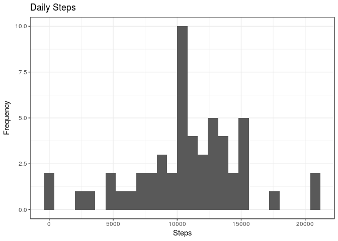
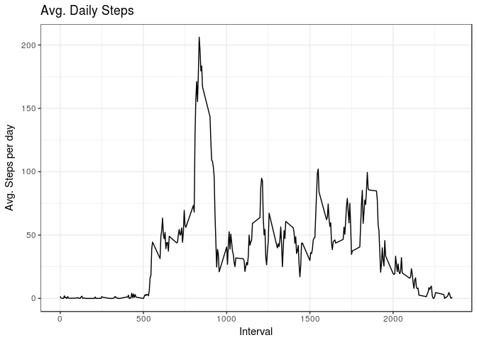
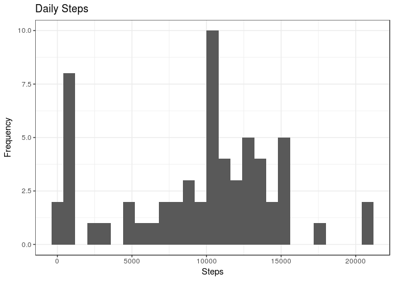
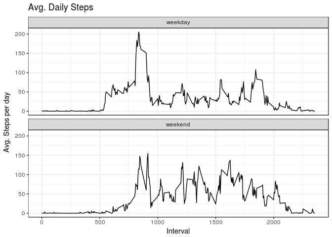

* Dataset: [Activity monitoring data](https://d396qusza40orc.cloudfront.net/repdata%2Fdata%2Factivity.zip) 

The variables included in this dataset are:

steps: Number of steps taking in a 5-minute interval (missing values are coded as 𝙽𝙰) </br>
date: The date on which the measurement was taken in YYYY-MM-DD format </br>
interval: Identifier for the 5-minute interval in which measurement was taken </br>
The dataset is stored in a comma-separated-value (CSV) file and there are a total of 17,568 observations in this dataset. 

## Loading and preprocessing the data
We start with downloading and extracting data to obtain a csv file.


```r
library(data.table)
```

```
## data.table 1.10.4.3
```

```
##   The fastest way to learn (by data.table authors): https://www.datacamp.com/courses/data-analysis-the-data-table-way
```

```
##   Documentation: ?data.table, example(data.table) and browseVignettes("data.table")
```

```
##   Release notes, videos and slides: http://r-datatable.com
```

```r
library(ggplot2)
```

```
## Need help getting started? Try the cookbook for R:
## http://www.cookbook-r.com/Graphs/
```

```r
library(dplyr)
```

```
## 
## Attaching package: 'dplyr'
```

```
## The following objects are masked from 'package:data.table':
## 
##     between, first, last
```

```
## The following objects are masked from 'package:stats':
## 
##     filter, lag
```

```
## The following objects are masked from 'package:base':
## 
##     intersect, setdiff, setequal, union
```

```r
fileUrl <- "https://d396qusza40orc.cloudfront.net/repdata%2Fdata%2Factivity.zip"
download.file(fileUrl, destfile = paste0(getwd(), '/repdata%2Fdata%2Factivity.zip'), method = "curl")
unzip("repdata%2Fdata%2Factivity.zip",exdir = "data")
```

Read the csv file into data table format and transform it into more convenient tibble: 

```r
activity <- data.table::fread(input = "data/activity.csv")
activity <- tbl_df(activity) 
```

Let's have a close look to the data: 


```r
activity
```

```
## # A tibble: 17,568 x 3
##    steps date       interval
##    <int> <chr>         <int>
##  1    NA 2012-10-01        0
##  2    NA 2012-10-01        5
##  3    NA 2012-10-01       10
##  4    NA 2012-10-01       15
##  5    NA 2012-10-01       20
##  6    NA 2012-10-01       25
##  7    NA 2012-10-01       30
##  8    NA 2012-10-01       35
##  9    NA 2012-10-01       40
## 10    NA 2012-10-01       45
## # ... with 17,558 more rows
```

```r
summary(activity)
```

```
##      steps            date              interval     
##  Min.   :  0.00   Length:17568       Min.   :   0.0  
##  1st Qu.:  0.00   Class :character   1st Qu.: 588.8  
##  Median :  0.00   Mode  :character   Median :1177.5  
##  Mean   : 37.38                      Mean   :1177.5  
##  3rd Qu.: 12.00                      3rd Qu.:1766.2  
##  Max.   :806.00                      Max.   :2355.0  
##  NA's   :2304
```

Let's get dates instead of character strings: 


```r
activity$date <- as.Date(activity$date)
```

## What is mean total number of steps taken per day?

1. Let's calculate total number of steps taken per day


```r
stepsTotal <- activity %>% 
        group_by(date)%>%
        summarize(total = sum(steps))

stepsTotal      
```

```
## # A tibble: 61 x 2
##    date       total
##    <date>     <int>
##  1 2012-10-01    NA
##  2 2012-10-02   126
##  3 2012-10-03 11352
##  4 2012-10-04 12116
##  5 2012-10-05 13294
##  6 2012-10-06 15420
##  7 2012-10-07 11015
##  8 2012-10-08    NA
##  9 2012-10-09 12811
## 10 2012-10-10  9900
## # ... with 51 more rows
```

2. Histogram of the total number of steps taken each day. 


```r
ggplot(stepsTotal, aes(x = total)) +
    geom_histogram(binwidth = 800) +
    labs(title = "Daily Steps", x = "Steps", y = "Frequency") + 
    theme_bw()
```

```
## Warning: Removed 8 rows containing non-finite values (stat_bin).
```

<!-- -->

3. Mean and median of the total number of steps taken per day are 10766.19 and 10765 respectively 

```r
stepsTotal %>% summarise(mean = mean(total, na.rm = T), median = median(total, na.rm = T))
```

```
## # A tibble: 1 x 2
##     mean median
##    <dbl>  <int>
## 1 10766.  10765
```

## What is the average daily activity pattern?

1. Make a time series plot (i.e. 𝚝𝚢𝚙𝚎 = "𝚕") of the 5-minute interval (x-axis) and the average number of steps taken, averaged across all days (y-axis)


```r
stepsAvg <- activity %>%
        group_by(interval)%>%
        summarise(average = mean(steps, na.rm = T))

ggplot(stepsAvg, aes(x = interval , y = average)) + 
        geom_line() + 
        labs(title = "Avg. Daily Steps", x = "Interval", y = "Avg. Steps per day") +
        theme_bw()
```

<!-- -->

2. Which 5-minute interval, on average across all the days in the dataset, contains the maximum number of steps?

Interval that has identifier 835 (at 8:35 am)

```r
stepsAvg %>% filter(average == max(average))
```

```
## # A tibble: 1 x 2
##   interval average
##      <int>   <dbl>
## 1      835    206.
```


## Imputing missing values

1. Calculate and report the total number of missing values in the dataset (i.e. the total number of rows with 𝙽𝙰s)

There are 2304 missing values, all of them are in the steps variable

```r
sum(is.na(activity))
```

```
## [1] 2304
```

```r
sum(is.na(activity$steps))
```

```
## [1] 2304
```

2. Devise a strategy for filling in all of the missing values in the dataset. The strategy does not need to be sophisticated. For example, you could use the mean/median for that day, or the mean for that 5-minute interval, etc.

We will use median value of steps for that interval


3. Create a new dataset that is equal to the original dataset but with the missing data filled in.

```r
test <- activity 
test <- test %>% 
        group_by(interval) %>%
        mutate(median = median(steps, na.rm = T)) 
       
test$steps[which(is.na(test$steps))] <- test$median[which(is.na(test$steps))] 
head(test) 
```

```
## # A tibble: 6 x 4
## # Groups:   interval [6]
##   steps date       interval median
##   <int> <date>        <int>  <int>
## 1     0 2012-10-01        0      0
## 2     0 2012-10-01        5      0
## 3     0 2012-10-01       10      0
## 4     0 2012-10-01       15      0
## 5     0 2012-10-01       20      0
## 6     0 2012-10-01       25      0
```
We wanna be sure that the imputation has worked. But as for the night hours the amount of steps is really skewed towards 0 steps, let's test it on intervals with greater activity


```r
filter(activity, interval == 835)
```

```
## # A tibble: 61 x 3
##    steps date       interval
##    <int> <date>        <int>
##  1    NA 2012-10-01      835
##  2     0 2012-10-02      835
##  3    19 2012-10-03      835
##  4   423 2012-10-04      835
##  5   470 2012-10-05      835
##  6   225 2012-10-06      835
##  7     0 2012-10-07      835
##  8    NA 2012-10-08      835
##  9   635 2012-10-09      835
## 10     0 2012-10-10      835
## # ... with 51 more rows
```

```r
filter(test, interval == 835)
```

```
## # A tibble: 61 x 4
## # Groups:   interval [1]
##    steps date       interval median
##    <int> <date>        <int>  <int>
##  1    19 2012-10-01      835     19
##  2     0 2012-10-02      835     19
##  3    19 2012-10-03      835     19
##  4   423 2012-10-04      835     19
##  5   470 2012-10-05      835     19
##  6   225 2012-10-06      835     19
##  7     0 2012-10-07      835     19
##  8    19 2012-10-08      835     19
##  9   635 2012-10-09      835     19
## 10     0 2012-10-10      835     19
## # ... with 51 more rows
```

```r
# It worked! 
test$median <- NULL #so the dataset is equal to the original one
```

4. Make a histogram of the total number of steps taken each day and calculate and report the mean and median total number of steps taken per day. Do these values differ from the estimates from the first part of the assignment? What is the impact of imputing missing data on the estimates of the total daily number of steps?


```r
stepsTotalImputed <- test %>% 
        group_by(date)%>%
        summarize(total = sum(steps)) #preliminary step for the histogram

stepsTotalImputed %>% summarise(mean = mean(total, na.rm = T), median = median(total, na.rm = T))
```

```
## # A tibble: 1 x 2
##    mean median
##   <dbl>  <int>
## 1 9504.  10395
```

The new calculated values indead differ:

Estimate | Mean | Median
--- | --- | ---
With NA | 10766.19 | 10765
Without NA (imputed by median for the time interval) | 9503.87 | 10395


```r
ggplot(stepsTotalImputed, aes(x = total)) +
    geom_histogram(binwidth = 800) +
    labs(title = "Daily Steps", x = "Steps", y = "Frequency") + 
    theme_bw()
```

<!-- -->

But in general, the shape of the histogram hasn't changed a lot. The impact of imputing missing values by using a median for that specific interval (in which NA occurs) is that the values became not so sensitive for extreem values. 

## Are there differences in activity patterns between weekdays and weekends?

1. Create a new factor variable in the dataset with two levels – “weekday” and “weekend” indicating whether a given date is a weekday or weekend day.


```r
test <- test %>%
        mutate(day = "weekday")
test$day[weekdays(test$date) %in% c("Saturday", "Sunday")] <- "weekend" 

test$day <- as.factor(test$day)
table(test$day)
```

```
## 
## weekday weekend 
##   12960    4608
```

2. Make a panel plot containing a time series plot (i.e. 𝚝𝚢𝚙𝚎 = "𝚕") of the 5-minute interval (x-axis) and the average number of steps taken, averaged across all weekday days or weekend days (y-axis). See the README file in the GitHub repository to see an example of what this plot should look like using simulated data.


```r
stepsAvgImputed <- test %>%
        group_by(interval, day)%>%
        summarise(average = mean(steps))

ggplot(stepsAvgImputed, aes(x = interval , y = average)) + 
        geom_line() + 
        facet_wrap(~ day, ncol = 1, nrow=2)+
        labs(title = "Avg. Daily Steps", x = "Interval", y = "Avg. Steps per day") +
        theme_bw()
```

<!-- -->
